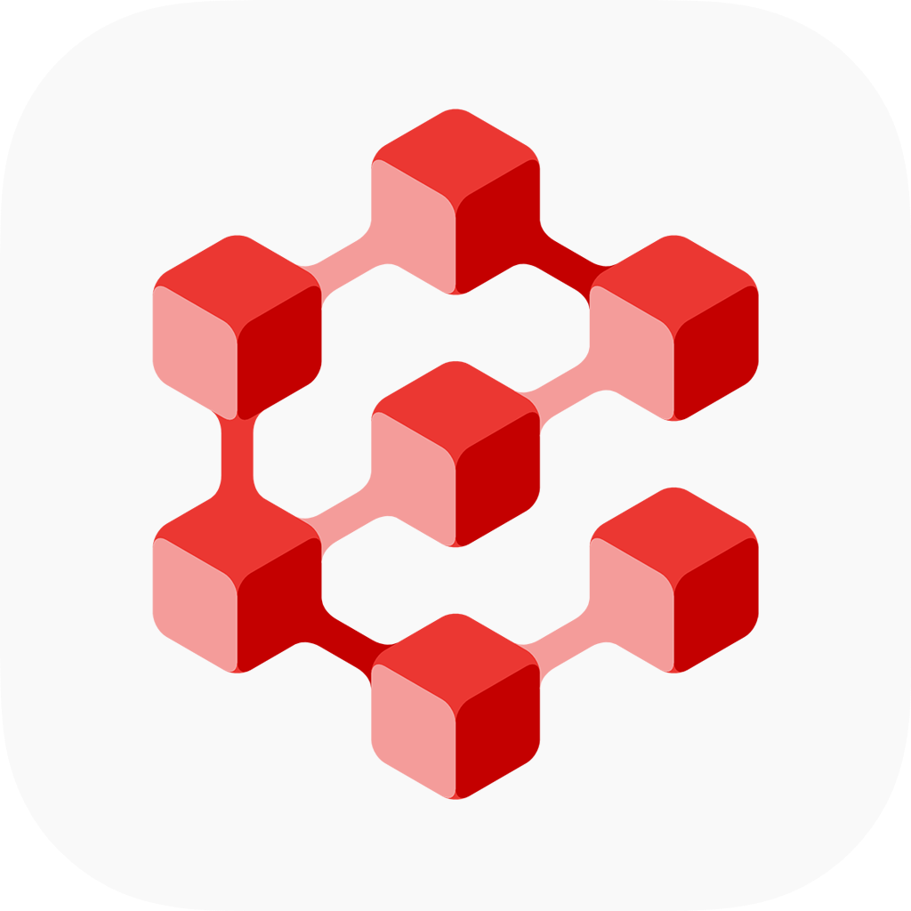
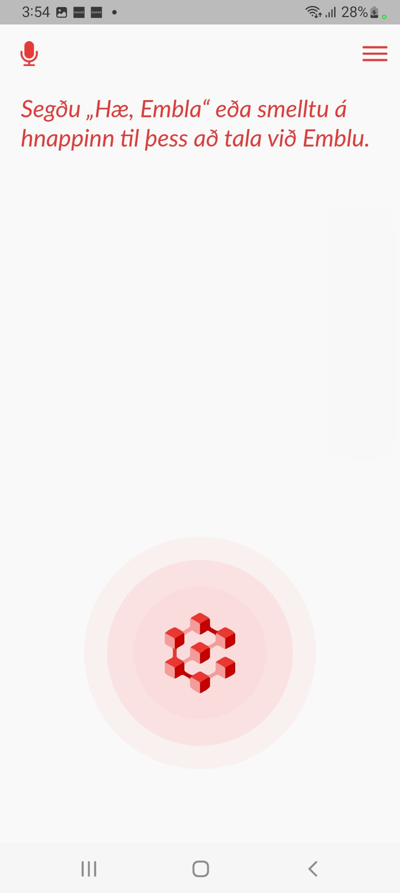
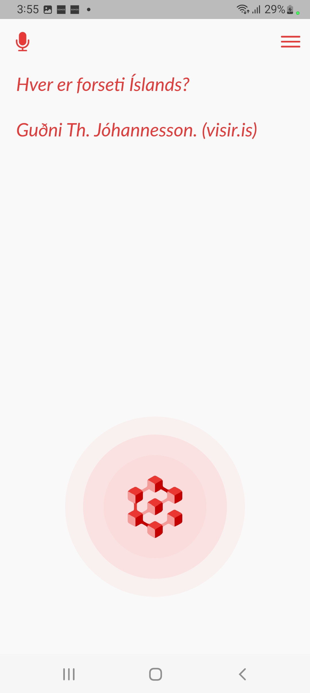
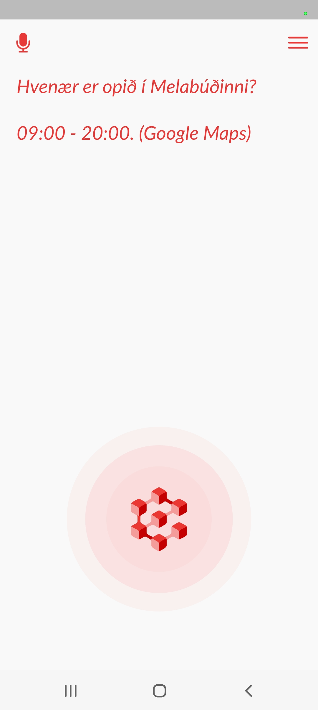

[](https://www.gnu.org/licenses/gpl-3.0)
[]()


[]()



# Embla Flutter Client

Embla is an Icelandic-language voice assistant app powered by the
[Greynir](https://greynir.is) query engine. This is the repository
for the cross-platform Embla mobile client.

The client is implemented in [Dart](https://dart.dev/) using the
[Flutter](https://flutter.dev) framework, currently built to run on
Android 8.1+ (SDK >= 27) and iOS 12+.

<a href="https://play.google.com/store/apps/details?id=is.mideind.embla">
    
</a>

## Build instructions

Building the Embla client requires the Flutter framework:

* [Install Flutter](https://flutter.dev/docs/get-started/install)

Building for Android requires a recent version of Android Studio. Building for iOS
requires a recent version of Xcode.

Clone the repository:

```bash
git clone https://github.com/mideind/EmblaFlutterApp.git
```

In order to work as intended, the app requires an API key for the Ratatoskur server
backend. Save this key in a text file at the following path within the repository:

```keys/server.key```

Then run the following script:

```bash
bash keys/gen_keysfile.sh
```

You should now be able to build and run the app:

```bash
flutter run -d [device_id]
```

This should launch the app in development mode on your device.

## Debug build scripts

To build an unsigned Android `apk` debug binary for arm64, run the following script:

```bash
bash build_apk.sh
```

To build an unsigned iOS `ipa` debug bundle, run the following script:

```bash
bash build_ipa.sh
```

To create a signed iOS build that will run on an actual device, you need to set
up an [Apple Developer Account](https://developer.apple.com) and enable signing
in the Xcode project.

## Screenshots

<p float="left">
    
    
    
</p>

## Acknowledgements

The Embla client uses [Snowboy](https://github.com/seasalt-ai/snowboy) for hotword
detection.

## License

Embla is Copyright (C) 2019-2023 [Miðeind ehf.](https://mideind.is)

<a href="https://mideind.is"></a>

This program and its source code is free software: you can redistribute it and/or modify it
under the terms of the GNU General Public License as published by the Free
Software Foundation, either version 3 of the License, or (at your option) any later
version.

This program is distributed in the hope that it will be useful, but WITHOUT
ANY WARRANTY; without even the implied warranty of MERCHANTABILITY or FITNESS FOR
A PARTICULAR PURPOSE. See the GNU General Public License for more details.

The full text of the GNU General Public License v3 is
[included here](https://github.com/mideind/PyEmbla/blob/master/LICENSE.txt)
and also available here:
[https://www.gnu.org/licenses/gpl-3.0.html](https://www.gnu.org/licenses/gpl-3.0.html).

If you wish to use this program in ways that are not covered under the
GNU GPLv3 license, please contact us at [mideind@mideind.is](mailto:mideind@mideind.is)
to negotiate a custom license. This applies for instance if you want to include or use
this software, in part or in full, in other software that is not licensed under
GNU GPLv3 or other compatible licenses.

The Embla logo, icon and other images are Copyright (C) Miðeind ehf. and may not
be used without permission.
